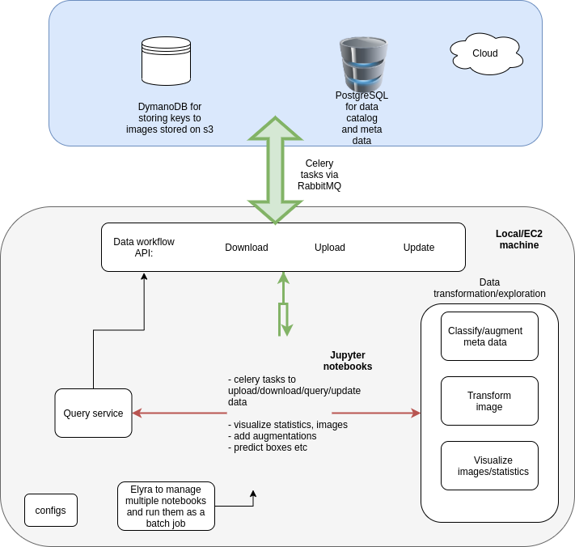

# Service to build pipelines for ingesting, quering, visualizing, transforming and updating data.



* OS dependencies:
```bash
$: sudo apt-get install rabbitmq-server
```

* Python dependencies:
```bash
$: cd 
$: sudo pip install -r requirements.txt
```

* Init AWS engine
```bash
$: cat ~/.aws/credentials
[default]
aws_access_key_id = <aws_access_key_id>
aws_secret_access_key = <aws_secret_access_key>
region = us-west-2
```
## Create tables in DynamoDB and in Postgre
### 
```bash
$: cd data_pipeline_processor/data_workflow_api
$: python3 init_engine_aws.py
$: python3 init_engine_postgre.py
```
## Ingest data

* Run celery:
```bash
$: cd data_pipeline_processor/data_workflow_api
$: celery -A celery_tasks worker --loglevel=info
```
* Run tasks    
    
*HOWTO [ingest data examples]()
    from celery_tasks import load_csv_to_postgre, load_meta_data_to_postgre, put_data_s3_by_record_from_query
    
    path_to_dataset = '' # make sure is has subfolders named styles and images

    put_data_s3_by_record_from_query_ = put_data_s3_by_record_from_query.apply_async(queue='low_priority', args=(path_to_dataset))
    put_data_s3_by_record_from_query_.ready()
    put_data_s3_by_record_from_query_.get(timeout=100)


* Monitor workers with [flower](https://flower.readthedocs.io/en/latest/)

```bash
$: cd data_pipeline_processor/data_workflow_api
$: celery -A celery_tasks flower --port=5555
```

## Query data and save results to a folder

```bash
$: cd data_pipeline_processor/query_service/
$: celery -A query_celery_tasks worker --loglevel=info
```
*HOWTO [query examples]()

    from query_celery_tasks import get_queried_data_from_s3_by_one, get_query_for_inspection, update_meta_data_postgre
    
    from queries_config import WOMEN_ACCESSORIES_CASUAL_QUERY, MAN_OPEN_SHOES_FALL, UNISEX_SUMMER, META_DATA_UPDATE_QUERY, PATH_TO_SAVE_CSV, PATH_TO_SAVE_IMAGES
    
    get_queried_data_from_s3_by_one(WOMEN_ACCESSORIES_CASUAL_QUERY, 100, PATH_TO_SAVE_IMAGES)

    folder_for_images = get_queried_data_from_s3_by_one.apply_async(queue='low_priority', args=(WOMEN_ACCESSORIES_CASUAL_QUERY, 100, PATH_TO_SAVE_IMAGES))
    folder_for_images.ready()
    folder_for_images.get(timeout=10)
...
## Transform data
For getting features for queried images we use `MMFashion` which is an open source visual fashion analysis toolbox based on [PyTorch](https://pytorch.org/). It is a part of the [open-mmlab](https://github.com/open-mmlab) project developed by [Multimedia Lab, CUHK](http://mmlab.ie.cuhk.edu.hk/).

## Installation

```sh
git clone --recursive https://github.com/open-mmlab/mmfashion.git
cd mmfashion
python setup.py install
```

*HOWTO work with quiried images

    from data_transformator.exploratory_data_analysis import plot_random_images_from_folder
    from data_transformator.get_augmentations import augment_and_show, crop_transformation, resize_transformation
    from data_transformator.add_features_to_meta import add_landmarks
...
## Service performance


...
## Further considerations
- 